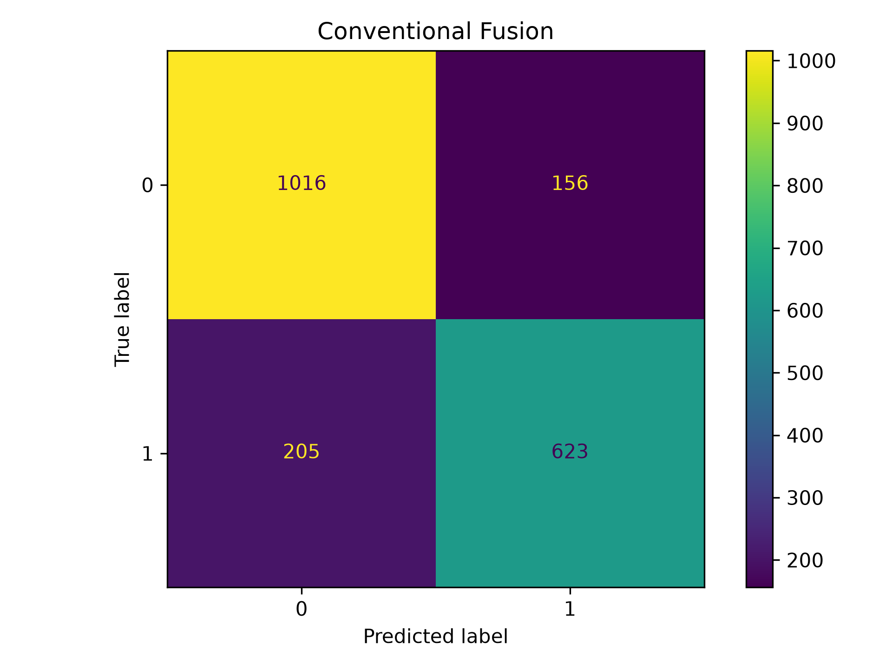
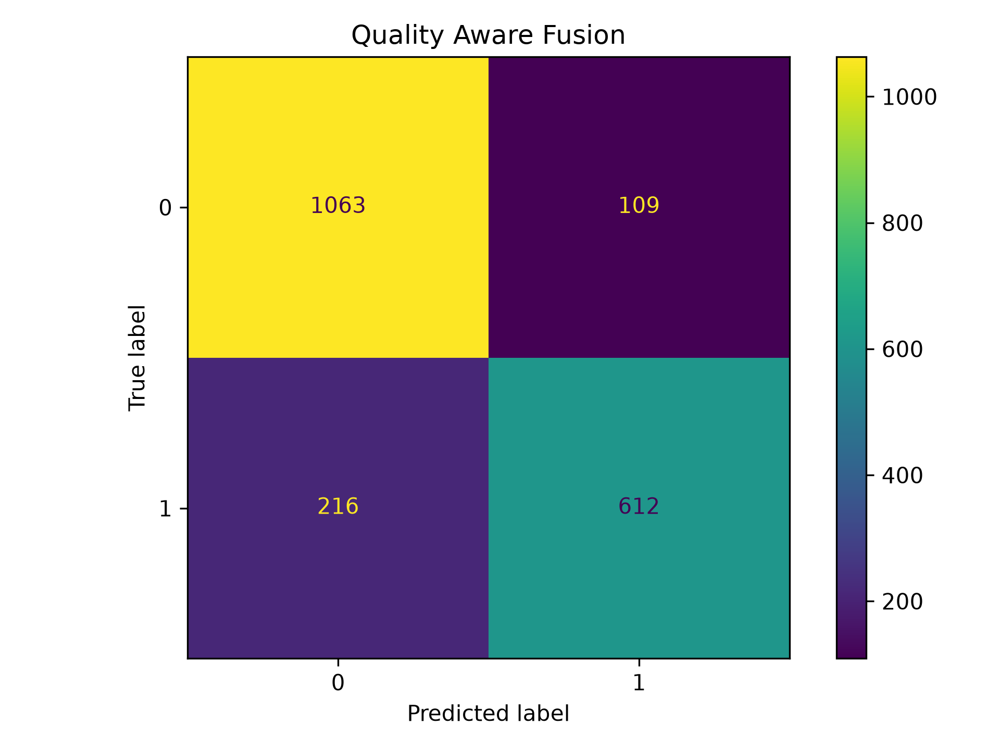
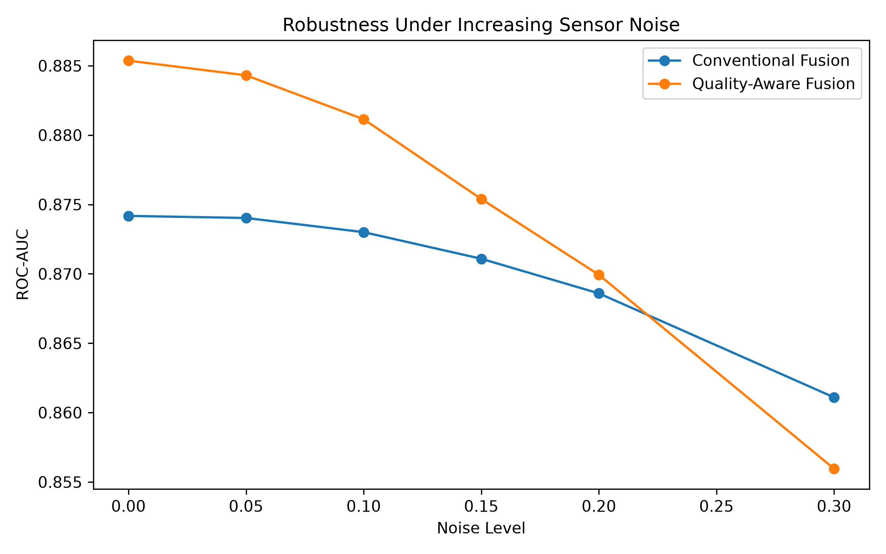
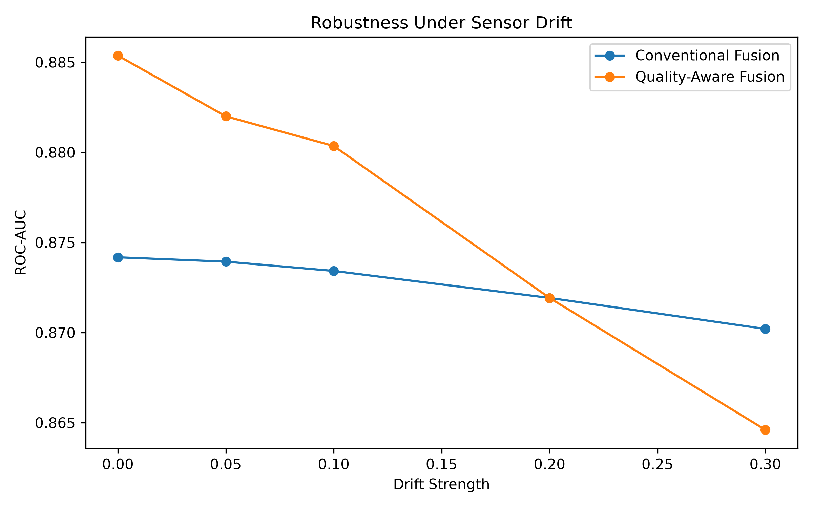
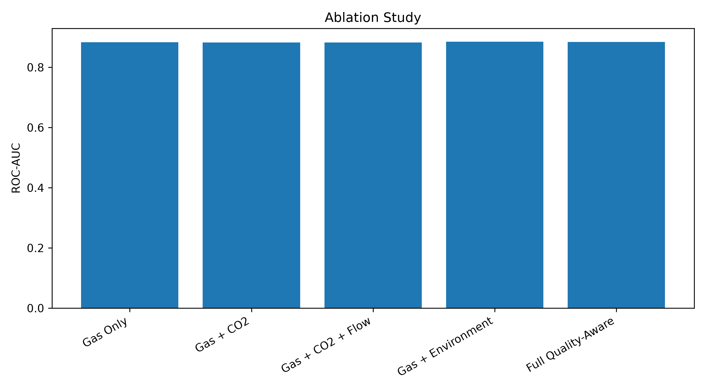
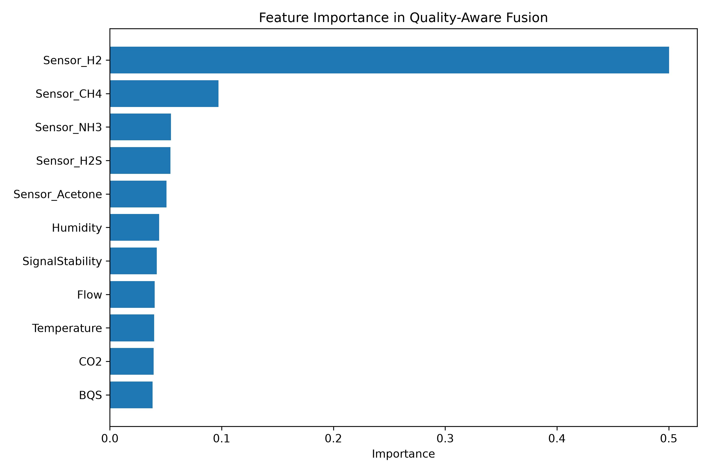
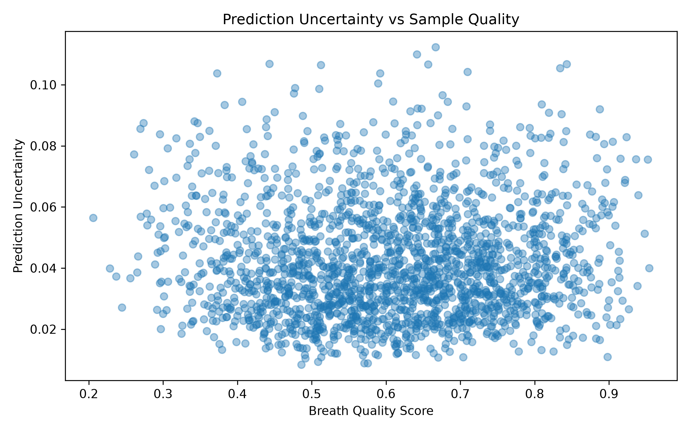
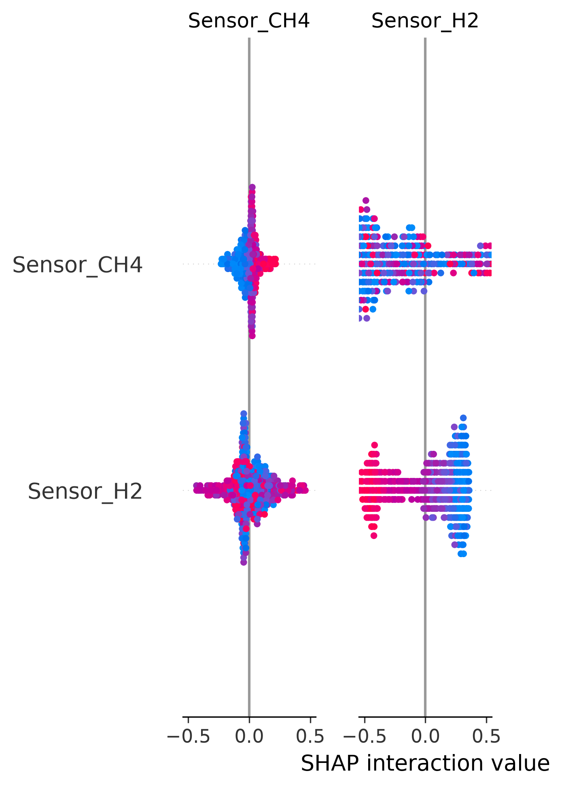

# Multi-Gas Sensor Fusion: Robustness & Uncertainty Simulator

A synthetic-data testbed for stress-testing a multi-sensor gas fusion
pipeline under noise, drift, cross-sensitivity, and poor sample capture
— with built-in uncertainty quantification and explainability.

> **Scope note:** everything here — gas concentrations, sensor readings,
> and labels — is synthetically generated. This is an engineering
> methodology project (robustness, uncertainty, explainability), not a
> diagnostic or clinical one. See [Why the label has injected noise](#why-the-label-has-injected-noise)
> before quoting any number from this repo.

---

## What it tests

| Question | Where it's answered |
|---|---|
| Does fusing quality metadata with raw sensor readings beat a naive gas-only model? | [Model comparison](#1-model-comparison) |
| How gracefully does each approach degrade as sensors get noisier / drift over time? | [Robustness sweeps](#2-robustness-under-noise--drift) |
| Which quality features actually earn their place? | [Ablation study](#3-ablation-study) |
| Can the ensemble tell you when *not* to trust a reading? | [Uncertainty vs. sample quality](#4-uncertainty-quantification) |
| Is the model's reasoning inspectable, or a black box? | [SHAP explainability](#5-explainability) |

## Pipeline

```
synthetic latent gases ──▶ sensor simulation ──▶ breath quality score (BQS)
   (5 gases)               (cross-sensitivity,         │
                            humidity/temp drift,        ▼
                            noise, poor capture)   ┌─────────────────────┐
                                                    │ Conventional Fusion │  (gas readings only)
                                                    │ Quality-Aware Fusion│  (gas + BQS + env)
                                                    └─────────────────────┘
                                                              │
                                    ┌─────────────────────────┼─────────────────────────┐
                                    ▼                         ▼                         ▼
                          noise/drift sweeps         bootstrap uncertainty        SHAP attribution
```

## Results

### 1. Model comparison

| Model | Accuracy | Precision | Recall | F1 | ROC-AUC |
|---|---|---|---|---|---|
| Conventional Gas Fusion | 0.820 | 0.800 | 0.752 | 0.775 | 0.874 |
| **Quality-Aware Multi-Gas Fusion** | **0.838** | **0.849** | 0.739 | **0.790** | **0.885** |

Quality-aware fusion wins on every metric except recall — fusing in
environmental/quality signal gives a consistent, modest edge over
raw gas readings alone.

<p align="center">
  
  
</p>

### 2. Robustness under noise & drift

| Noise level | Conventional AUC | Quality-Aware AUC |
|---|---|---|
| 0.00 | 0.874 | 0.885 |
| 0.10 | 0.873 | 0.881 |
| 0.20 | 0.869 | 0.870 |
| 0.30 | 0.861 | 0.856 |

The quality-aware model's advantage shrinks as noise rises and the two
converge by noise level 0.2–0.3 — a realistic finding, not a "quality-aware
always wins" story, which is what makes the sweep worth showing.

<p align="center">
  
  
</p>

### 3. Ablation study

<p align="center"></p>

Adding CO2 and flow alone barely moves the needle; humidity + temperature
(full environmental context) is what actually improves ROC-AUC over
gas-only — visible directly in the bar heights above.

<p align="center"></p>

### 4. Uncertainty quantification

A 10-model bootstrap ensemble's prediction spread is checked against the
independent Breath Quality Score — if uncertainty rises as BQS drops,
the ensemble is correctly "aware" of low-quality inputs.

<p align="center"></p>

### 5. Explainability

<p align="center"></p>

SHAP confirms the fusion model relies primarily on the gas sensor channels,
with BQS and signal stability contributing secondary, interpretable adjustments
— not acting as a black box.

### 6. Gas concentration regression (clean task, no label-noise caveat)

| Gas | MAE | RMSE | R² |
|---|---|---|---|
| H2 | 4.92 | 7.49 | 0.930 |
| CH4 | 2.54 | 3.83 | 0.931 |
| H2S | 1.10 | 1.57 | 0.928 |
| NH3 | 1.15 | 1.68 | 0.916 |
| Acetone | 2.47 | 3.78 | 0.930 |

Unlike the classification target, this regresses directly onto the true
latent gas values — no synthetic-label design choices to caveat.

---

## Why the label has injected noise

An earlier version of this script defined the classification target as a
clean, deterministic threshold on the same latent gas concentrations that
(via a near-linear sensor transform) become the model's input features.
That made the task easier than it looked — accuracy would have been
artificially close to 1.0 and wouldn't survive someone asking "how was
ground truth defined?"

This version injects an irreducible noise rate (`LABEL_NOISE_RATE = 0.08`)
into the label after thresholding, simulating real-world uncertainty no
sensor could resolve. The ROC-AUC of ~0.87–0.89 above reflects that honestly.

## Running it

```bash
pip install numpy pandas matplotlib scikit-learn joblib shap
python sensor_fusion_simulator.py
```

Outputs (CSVs, all plots above, saved `.pkl` models) land in `results/`.

## Limitations

- Simulation ranges and noise models are illustrative, not
  literature-calibrated — a methodology demo, not a device-ready model.
- No real sensor hardware or human breath samples were involved.
- Not affiliated with, and should not be confused with, any capstone
  project using real measured data.
